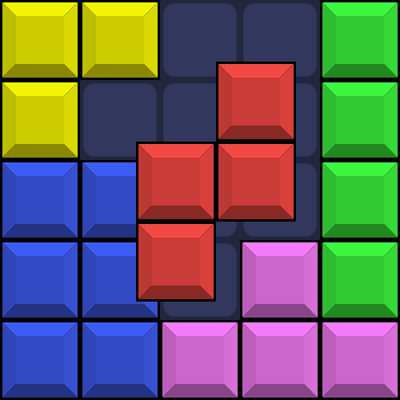

# Brick Pop!
A clone of Block Blast! made in Godot.
### [Play on itch.io](https://kaasos.itch.io/brickpop)

</img>

## TODO
- Figure out a reasonable scoring system
- Add missing shapes
- Combo and full-clear announcment

## Potential features
- Levels
- Animations
